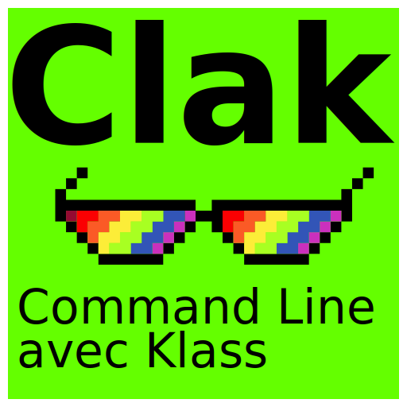

# Clak

<p align='center'>

</p>

<p align='center'>


</p>

Clak (*Command Line avec Klass*) is a Python library for building command-line
interfaces with a **class-based** API on top of standard `argparse`. Nested
commands, arguments, and optional batteries (views, logging, config, completion)
stay close to what you already know from the stdlib.

Full docs: [mrjk.github.io/python-clak](https://mrjk.github.io/python-clak/) ·
PyPI: [mrjk.clak](https://pypi.org/project/mrjk.clak/)

## Features

- **Class-based CLI** — define apps with `Parser`, `Argument`, and `Command`; no new DSL
- **Argparse-native** — same argument syntax as `add_argument()` / subparsers
- **Nested commands** — git-like trees with inheritance and a command overview in `--help`
- **Optional components** — views, logging, XDG config, shell-completion script generation
- Light core; extras only when you need them (`colors`, `config`)

## Requirements

- Python 3.10 or higher
- `argparse` (stdlib)

## Install

```bash
pip install mrjk.clak

# Or with your project manager
poetry add mrjk.clak
pdm add mrjk.clak
uv add mrjk.clak
```

Optional:

```bash
pip install 'mrjk.clak[colors]'   # coloredlogs for LoggingOptMixin
pip install 'mrjk.clak[config]'   # PyYAML for YAML config / --format yaml
```

## Quick start

```python
from clak import Argument, Command, Parser


class ShowCommand(Parser):
    """Show something."""

    target = Argument("--target", "-t", help="Target to show")
    format = Argument(
        "--format", choices=["json", "text"], help="Output format"
    )

    def cli_run(self, target=None, format=None, **_):
        print(f"show target={target} format={format}")


class MainApp(Parser):
    """Demo application."""

    debug = Argument("--debug", action="store_true", help="Enable debug mode")
    config = Argument("--config", "-c", help="Config file path")

    show = Command(ShowCommand, help="Show something")


# Instantiating the root parser parses argv and runs the matching command.
if __name__ == "__main__":
    MainApp()
```

```bash
$ python demo.py --help
usage: demo.py [-h] [--debug] [--config CONFIG] {show} ...
```

## Key concepts

### Arguments

```python
class MyCommand(Parser):
    verbose = Argument("-v", "--verbose", action="store_true", help="Verbose")
```

### Nested commands

`Command` binds a child `Parser` (aliases: `SubParser`, `SubCommand`, `Cmd`):

```python
class MainApp(Parser):
    status = Command(StatusCommand, help="Show status")
```

### Optional components

| Component | Mixin / class | Docs |
| --- | --- | --- |
| Tables / structured output | `ListViewMixin`, `ShowViewMixin`, `PprintViewMixin` | [Views](https://mrjk.github.io/python-clak/docs/views/) |
| Logging + `-v` | `LoggingOptMixin` | [Logging](https://mrjk.github.io/python-clak/docs/logging/) |
| XDG paths + config file | `XDGConfigMixin` | [Config](https://mrjk.github.io/python-clak/docs/config/) |
| Shell completion scripts | `CompCmdRender` | [Completion](https://mrjk.github.io/python-clak/docs/completion/) |

## Learn more

- [Installation](https://mrjk.github.io/python-clak/quickstart/install/) and [Quickstart](https://mrjk.github.io/python-clak/quickstart/quickstart/)
- Guides under `docs/` / the site **Guides** tab
- Pasteable AI context: [primer](https://mrjk.github.io/python-clak/ai/primer/) · [reference](https://mrjk.github.io/python-clak/ai/reference/)
- Runnable examples in [`examples/`](examples/)
- Planned work: [Roadmap](https://mrjk.github.io/python-clak/project/roadmap/)

## Contributing

Bug reports, questions, and PRs are welcome. See the contribution guidelines
in the documentation (or `CONTRIBUTING.md`).

## License

GPL v3.
