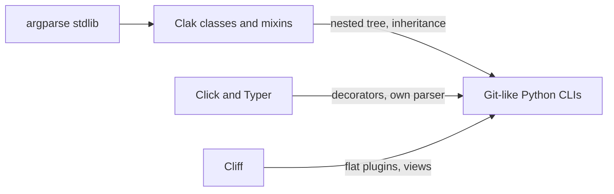

# How Clak compares

Clak is a class-based wrapper around Python's standard library `argparse`.
It is not a new parser. If you know argparse, you already know most of Clak.

This page compares Clak to argparse, Click, Typer, and Cliff. Design notes
also live in the [architecture ADRs](../architecture/list.md) (especially 2,
4, 5, 6, and 7). Feature list: [Features](features.md).

## Where Clak sits

- **Argparse:** same parser and argument kwargs. Clak changes how you author
  the CLI (classes instead of imperative `add_argument` calls).
- **Click / Typer:** decorator and function APIs on their own parsers. Easy
  to start; harder to share flags in large nested apps.
- **Cliff:** class-based commands and views on argparse. Built for
  plugin-discovered OpenStack CLIs. Clak takes the class-and-views idea
  without that plugin machinery.

## What Clak excels at

1. **Git-like nested CLIs.** Each subcommand is a `Parser` bound with
   `Command`. Parent options are visible to child `cli_run`. Root `--help`
   lists nested subcommands (`Meta.help_subcommands = "all"`, parent path
   hidden; `"top"` for immediate children only).
2. **Structure at scale.** Share options and behavior with class inheritance
   and mixins (`LoggingOptMixin`, view mixins) instead of duplicating flags
   on every function.
3. **Argparse familiarity.** `Argument(...)` uses the same kwargs as
   `add_argument(...)`. There is no new option DSL.
4. **Light core, optional batteries.** Views, logging, XDG config, Rich help,
   and completion scripts are mixins or extras. Install `colors`, `config`,
   `markdown`, or `rst` only when you need them.
5. **Cliff-style output without Cliff.** Return data from `cli_run`;
   `ShowViewMixin` / `ListViewMixin` render tables or
   `--format json|yaml|csv`. Suited to ops tools that need both human tables
   and machine output.
6. **Stdlib-first runtime.** Clak builds a real argparse tree. Startup stays
   close to argparse rather than a Click/Typer stack.

Clak is not aimed at one-function annotated scripts (Typer's strength) or
third-party plugin-discovered CLIs (Cliff's strength).

## Similarity to argparse

Canonical mapping:

- `argparse.ArgumentParser()` -> `class MyApp(Parser):`
- `.add_argument(...)` -> `dest = Argument(...)`
- `.add_subparsers()` / `.add_parser()` ->
  `name = Command(ChildParser, help=...)`

Details that stay the same:

- Keyword arguments: `action`, `choices`, `help`, `nargs`, `type`,
  `default`, and the rest of `add_argument`.
- Positionals vs optionals: bare names vs flags that start with `-` / `--`.
  Optional helpers `Arg` (positionals only) and `Opt` (flags only) reject
  mixed names.
- Re-exported constants: `OPTIONAL`, `SUPPRESS`, `ZERO_OR_MORE`,
  `ONE_OR_MORE`.
- Help groups: `option_group` / `argument_group` map to
  `add_argument_group`. `exclusive_group` maps to a mutually exclusive
  group. `Command(..., command_group=)` plus `Meta.command_groups` is
  formatter-only (one `add_subparsers`).
- Parse errors come from argparse (`ArgumentError`); Clak wraps them for a
  stable message.
- The help formatter subclasses `argparse.RawDescriptionHelpFormatter`.

Instantiating the root parser (`App()`) parses `argv` and runs the matching
command, unless you pass `parse=False`.

What argparse users should not expect yet:

- Click or Typer decorator patterns
- Automatic mapping of environment variables to CLI options (planned)
- Merging two argparse parser objects
  ([ADR 0003](../architecture/0003-no-argparse-merging.md))
- Fully wired runtime `argcomplete` during parse (shell-script generation
  already ships)

## Versus Click and Typer

Click and Typer optimize for a low first-command learning curve: decorate a
function, get a CLI. Typer adds type annotations and Rich output.

Where Clak differs:

- **API:** classes (`Parser`, `Argument`, `Command`), not `@click.command` /
  `typer.Option`. A decorator-first API is
  [out of scope](../project/roadmap.md).
- **Parser:** argparse. Click and Typer use Click's parser. `Argument(...)`
  is argparse, not a new option language.
- **Scale:** large nested CLIs in Click/Typer often duplicate the same flags
  and make help/group tweaks awkward. Clak shares them with inheritance and
  mixins.
- **Weight:** Clak's core is argparse plus descriptors. Click/Typer pull in
  more by default.
- **Nested commands:** Clak is a real subparser tree. Parent flags reach
  child `cli_run`. Click/Typer nest groups; running a group often needs an
  extra function.

Pick Click or Typer for a small annotated script. Pick Clak when the command
tree will grow and you already think in argparse.

## Versus Cliff

Cliff (OpenStack Command Line Interface Formulation Framework) is the
closest cousin: class-based commands, argparse, git-like apps, and views.

Where Clak differs:

- **Command shape:** Cliff is usually a flat list plus plugin discovery
  (entry points). Clak is a nested class tree you write in Python. Adding a
  subcommand is `Command(...)`, not package metadata.
- **Boilerplate:** Cliff targets huge, extensible CLIs. The learning curve
  is high; the cliffdemo is almost required. Clak targets the same
  nested-CLI problem with a `Parser` subclass and optional mixins.
- **Extensibility:** Cliff wins when third-party plugins must register
  commands. Clak wins when you own the tree.

## What Clak inherits from Cliff

Cliff is the main architectural influence, not only a competitor.
[ADR 0002](../architecture/0002-argparse-as-main-parser.md) lists Cliff as
the source of views, an opinionated class structure, and class-based config.
[ADR 0005](../architecture/0005-comparison-with-cliff.md) is the raw
comparison note.

Taken from Cliff (ideas, not a code fork):

- **Class-based commands on argparse.** A command is a class with a
  parse/run split, not a decorated function. Clak: `Parser` plus `cli_run`.
  Cliff: `Command` plus `take_action` / `get_parser`.
- **Opinionated structure.** Shared base classes and mixins instead of
  ad-hoc argparse wiring. Clak uses inheritance more for nested trees.
- **Views: return data, render later.** The command does not print a table
  itself. It returns structured data; a view formats it. See
  [Views](views.md).
- **Show vs List.** Cliff `ShowOne` (one object as key/value) and `Lister`
  (many rows) map to `ShowViewMixin` and `ListViewMixin`.
- **Output flags.** `--format view|yaml|json|csv`, `--columns`,
  `--sort-columns`, `--sort-mode`, `--width`. Same job as Cliff formatters
  (`table`, `json`, `csv`, `yaml`) and `--column` / `--sort-column`.
- **Ops / git-like target.** Nested admin tools: many subcommands, human
  table plus machine JSON/YAML.
- **Batteries in the same family.** Completion and views are first-class
  (built into Cliff; mixins/extras in Clak).

Not taken from Cliff:

- Stevedore / entry-point command discovery (Cliff's strongest feature)
- A flat command namespace (Clak uses nested argparse subparsers)
- Interactive shell (Cliff plus cmd2)
- The `take_action` contract of `(column_names, data)` tuples (Clak returns
  dicts, lists, or a view object)
- App / CommandManager boilerplate and plugin settings files

In short: Clak is Cliff's class-and-views model, nested and lighter, still
on argparse, without OpenStack plugin discovery.

## See also

- [Features](features.md)
- [Views](views.md)
- [Nested commands guide](../guides/guide_102.md)
- [Roadmap](../project/roadmap.md)
- [Architecture ADRs](../architecture/list.md)
