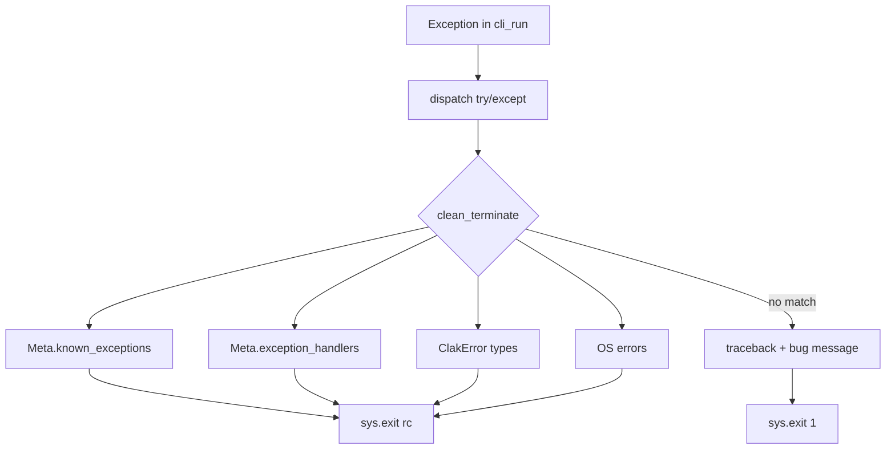

# Error handling

Clak wraps the whole CLI in a **try/except** inside `Parser.dispatch()`. When
anything fails, `clean_terminate()` walks a **handler chain** (same idea as
Paasify's `CatchErrors` + `clean_terminate` in `paasify/cli.py`). If nothing
matches, the user gets an **unexpected bug** message with a full Python
traceback and *please report to the developer*.

Runnable example: [`examples/script_exceptions.py`](https://github.com/mrjk/python-clak/blob/develop/examples/script_exceptions.py).

## Handler chain



| Step | Source | Typical use |
| --- | --- | --- |
| 1 | `Meta.known_exceptions` | Your app exception tree (`AppError`, `PaasifyError`, …) |
| 2 | `Meta.exception_handlers` | Third-party libs (YAML, shell, config backend, …) |
| 3 | Built-in | `ClakParseError`, `ClakUserError`, `ClakAppError`, … |
| 4 | Built-in | `FileNotFoundError`, `PermissionError`, … |
| 5 | Fallback | Uncaught bug — traceback + report to developer |

You do **not** wrap each command in try/except. Raise in `cli_run`; Clak
terminates consistently.

## Organize app exceptions (Paasify style)

Give each error a **stable exit code** (`rc`) and optional **advice**:

```python
# myapp/errors.py  (pattern from paasify/errors.py)

class AppError(Exception):
    rc = 1
    advice = None

    def __init__(self, message, rc=None, advice=None):
        self.advice = advice
        if rc is not None:
            self.rc = rc
        super().__init__(message)


class AppNotFound(AppError):
    rc = 44


class YAMLError(AppError):
    rc = 42


class ShellCommandFailed(AppError):
    rc = 18
```

Register the **base class once** on the root parser (Paasify v4 `AppMain`):

```python
from myapp.errors import AppError

class AppMain(Parser):
    class Meta:
        known_exceptions = [AppError]

    def cli_run(self, name, **_):
        raise AppNotFound(f"application {name!r} not found")
```

Clak prints the message, logs `advice` at WARNING if set, and exits with
`err.rc`.

### Custom handler for a known exception

Pass `(ExceptionClass, handler)` when the default message/rc is not enough:

```python
def handle_custom_error(app, err):
    print(f"Handled: {err}")
    sys.exit(7)

class Meta:
    known_exceptions = [
        AppError,                      # default: message + err.rc
        (SpecialError, handle_custom_error),
    ]
```

Handler signature: `handler(parser_node, err)`. It should call `sys.exit()`
(or let Clak exit with `err.rc` if it returns without exiting).

## Map third-party libraries

Paasify's `clean_terminate` maps library exceptions before the bug fallback:

| Library error | User message | Exit code |
| --- | --- | --- |
| `yaml.parser.ParserError` | YAML syntax / format | `YAMLError.rc` (42) |
| `sh.ErrorReturnCode` | Shell command failed | `ShellCommandFailed.rc` |
| `CaframException` | Config backend error | `ConfigBackendError.rc` |

In Clak, register the same mappings on `Meta.exception_handlers`:

```python
import yaml
import sh
from myapp.errors import YAMLError, ShellCommandFailed, ConfigBackendError


def handle_yaml_error(_app, err):
    logger.critical(err)
    logger.critical("Invalid YAML file (syntax or structure)")
    sys.exit(YAMLError.rc)


def handle_shell_error(_app, err):
    logger.critical(err)
    logger.critical("Command failed with exit code %s", err.exit_code)
    sys.exit(ShellCommandFailed.rc)


class AppMain(Parser):
    class Meta:
        known_exceptions = [AppError]
        exception_handlers = [
            (yaml.parser.ParserError, handle_yaml_error),
            (yaml.scanner.ScannerError, handle_yaml_error),
            (sh.ErrorReturnCode, handle_shell_error),
        ]
```

Handlers run **after** `known_exceptions` and **before** built-in Clak types.

## Built-in Clak exceptions

Use these when you do not have an app-specific type:

| Type | `rc` | When |
| --- | --- | --- |
| `ClakUserError` | `1` | User mistake (missing arg, bad value) |
| `ClakParseError` | `2` | Invalid CLI (usage printed first) |
| `ClakAppError` | `30` | Application / environment failure |
| `ClakNotImplementedError` | `31` | Stub command |
| `ClakBugError` | `32` | Broken invariant |

```python
from clak.exception import ClakUserError

raise ClakUserError(
    "profile 'staging' is not defined",
    advice="Run: myapp app diag APP --profile prod",
)
```

## Unexpected bugs

If the exception is not handled by any step, `dispatch()`:

1. Logs the **full traceback**.
2. Logs: `Uncaught error …; this may be a bug! Please report to the developer.`
3. Exits with code `1`.

``` raw linenums="0"
$ python script_exceptions.py broken
Traceback (most recent call last):
  ...
RuntimeError: unexpected failure in demo command

Uncaught error RuntimeError; this may be a bug! Please report to the developer.
```

For **handled** app/library errors, use `--trace` (from `LoggingOptMixin`) or
`CLAK_DEBUG=1` to also print the traceback **before** the handler chain runs.
See [Logging](logging.md).

## Full minimal app

``` python title="script_exceptions.py" linenums="1"
--8<-- "examples/script_exceptions.py"
```

``` raw linenums="0"
$ python script_exceptions.py deploy missing
application 'missing' not found
# exit 44

$ python script_exceptions.py load /tmp/bad.yaml
# YAML handler → exit 42

$ python script_exceptions.py broken
# exit 1, bug message
```

## What to avoid

```python
# Bad: per-command try/except that prints and returns
def cli_run(self, **_):
    try:
        work()
    except Exception as exc:
        print(exc)
        return 1

# Bad: manual sys.exit in business logic
def find_app(name):
    if name not in APPS:
        sys.exit(44)
```

Raise `AppError` / `ClakUserError` and let `dispatch()` + `clean_terminate()`
handle termination.

## Nested commands

`Meta.known_exceptions` and `Meta.exception_handlers` are read from the
**root** parser via `query_cfg_parents`, so they apply to every subcommand.

## See also

- Paasify reference: `paasify/cli.py` — `CatchErrors`, `clean_terminate`, `app()`
- Paasify v4: `paasify_v4/cli/main.py` — `known_exceptions = [PaasifyError]`
- [`demo108_exceptions.py`](https://github.com/mrjk/python-clak/blob/develop/tests/features/demo_features/demo108_exceptions.py)
- [Logging](logging.md) — `-v` / `--trace` / `CLAK_DEBUG` for diagnostics
